# DPP Orchestration Layer with OCI Event and Function: setup guide

## Scenario

This doc is to show how to setup OCI Events and Functions to make them work in synergy. In this example, the scenario is
once a config file in `json` is uploaded to assigned **object storage bucket**, an **event** listening to the bucket
will be triggered and it sends a signal to **OCI Function**, which will read the uploaded json and trigger a **OCI Data
Flow** job. We will use the [Remove unnecessary column](./remove_unnecessary_columns.md) as the data flow use case here.

## Main OCI Services Involved

- Object Storage Bucket
- Oracle Functions
- Events Service
- Data Flow
- Cloud Shell

## Setup

All related permissions are given to a dynamic group for operations in a compartment. Both compartment name and
compartment OCID are required to be able to continue with the setup.

### Create a compartment

Please refer to
[Managing Compartments](https://docs.oracle.com/en-us/iaas/Content/Identity/Tasks/managingcompartments.htm#Working)
to see how to create compartment if there is no compartment yet. Steps are also summarized below.

1. Click the hamburger menu.
   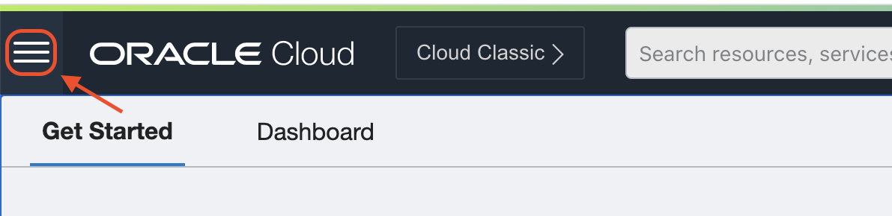
2. Select *Identity & Security* tab and select *Compartments* under *Identity* section.
   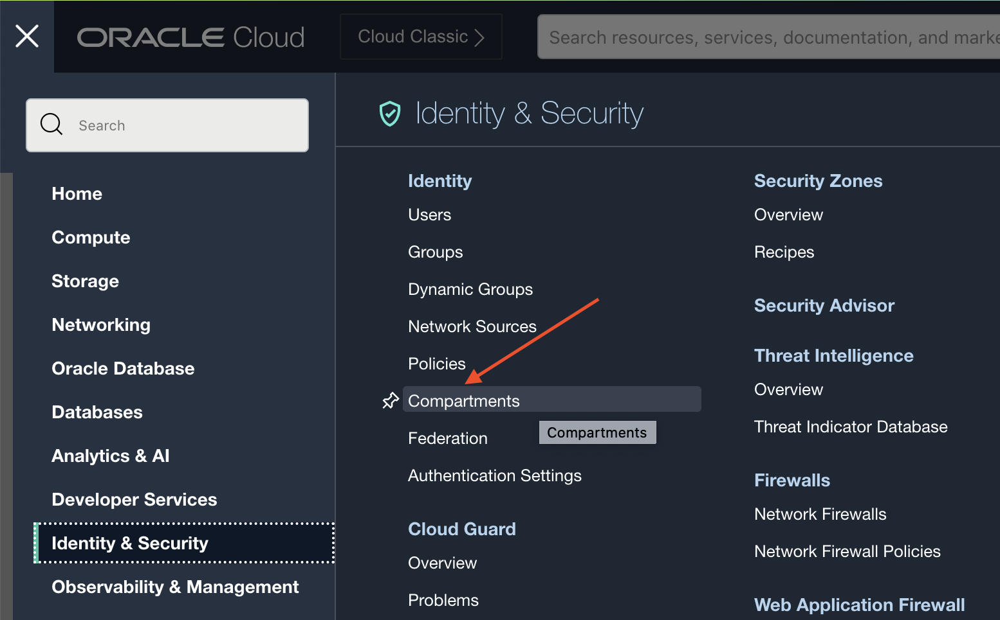
3. Click *Create Compartment* button.
   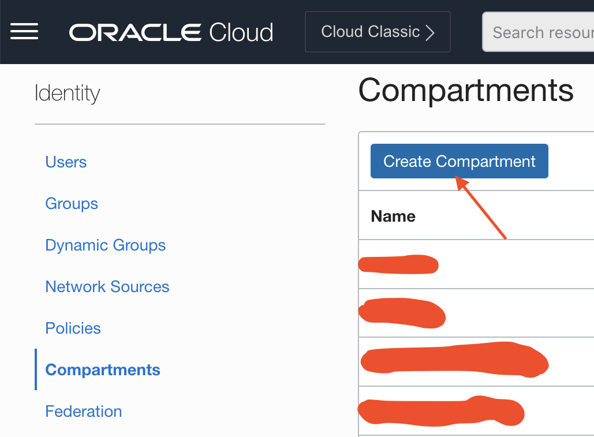
4. Add name and description. Select the parent of the new compartment and click on *Create Compartment* button.
   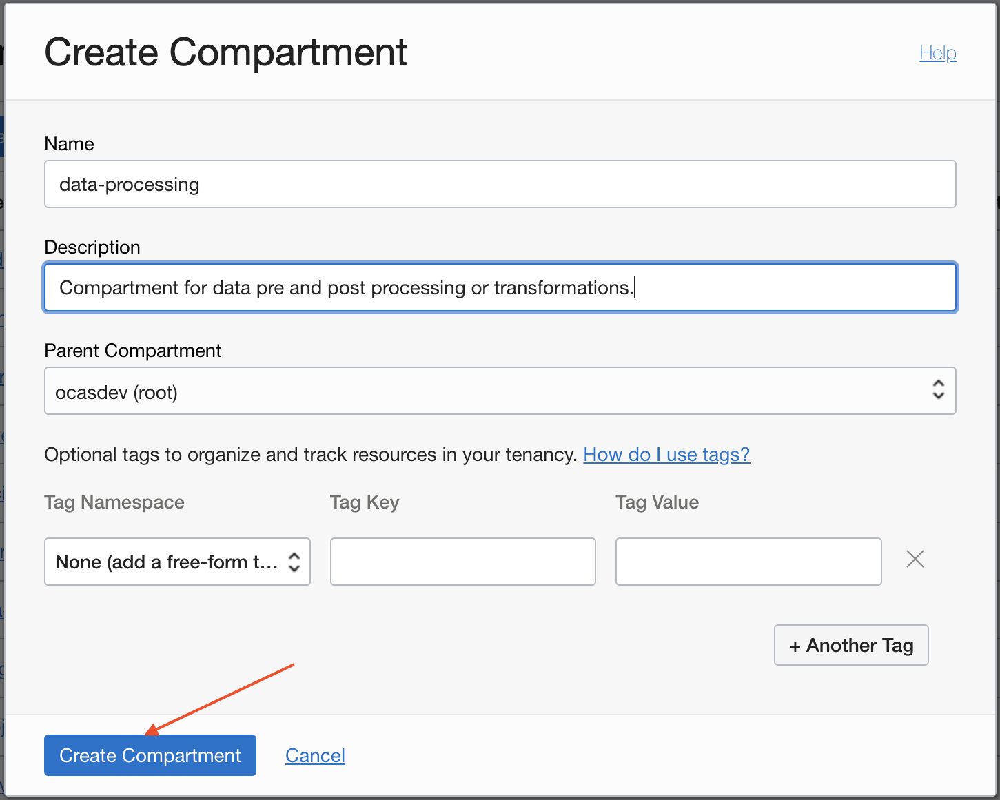

### Create a dynamic group

1. Click the hamburger menu.
   
2. Select *Identity & Security* tab and select *Dynamic Groups* under *Identity* section.
   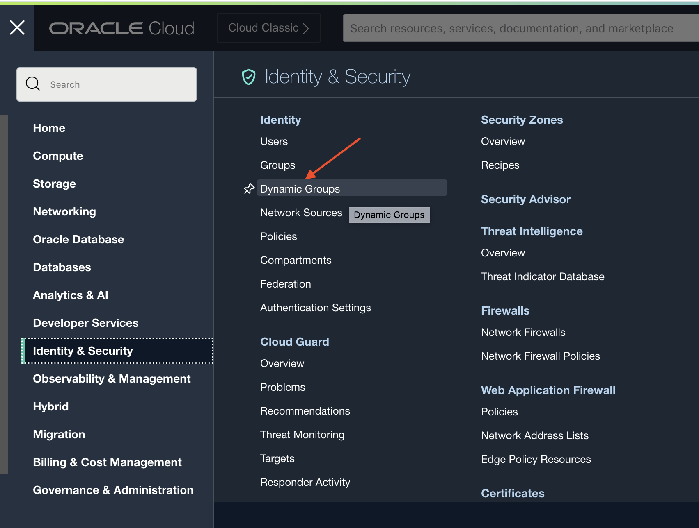
3. Click *Create Dynamic Group* button.
   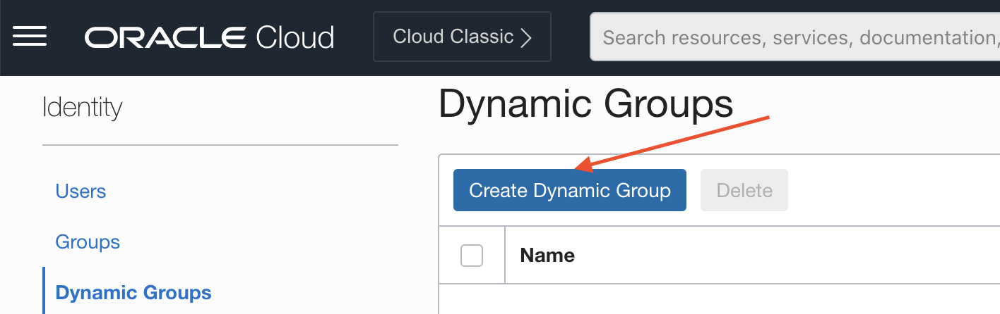
4. Add name and description fields. Select *Match any rules defined below* and add the below rule. Click on *Create*
   button.
   ```bash
   ALL {resource.type = 'fnfunc', resource.compartment.id = <compartment_ocid>}
   ```
   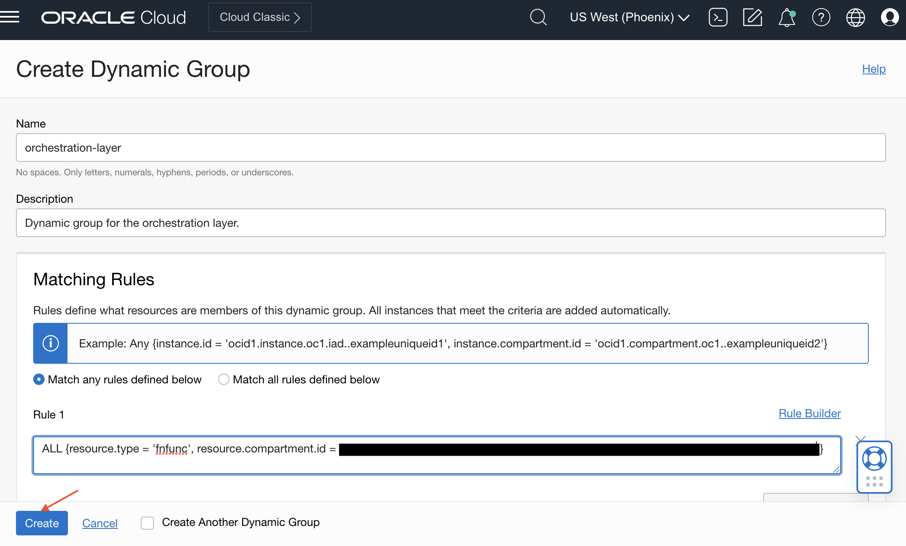

### Create object storage bucket

This step can be skipped if Object Storage Bucket is already available.

1. Click the hamburger menu.
   
2. Select *Storage* tab and select *Buckets* under *Object Storage & Archive Storage* section.
   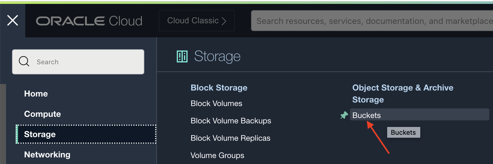
3. Select desired compartment and click *Create Bucket* button.
   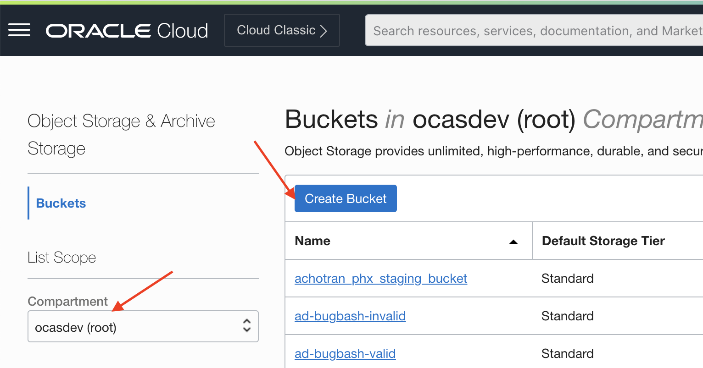
4. Add bucket name, select *Emit Object Events*, and then click on *Create* button.
   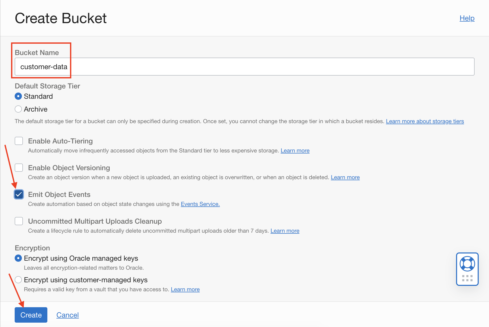

### Emit Object Events

This step can be skipped if the bucket is created using the above steps or using an existing bucket that has emit 
object events enabled.

After you created the bucket, don't foregt to enable `Emit Object Events` under bucket details page. Without this,
Events Service won't be able to catch any object related events.


### Add policy statements

Note that for convenience, *any-user* is used here, but it can be replaced with group or dynamic group for a limited
access. Also, below is the information on the place-holders used in the below policy statements.
* `<compartment>`: Name of the compartment where the resources will be managed (or the one created in the previous 
  steps).
* `<dynamic-group-name>`: Name of the dynamic group which will manage the resources in the above compartment (or the 
  one created in the previous steps).
* `<bucket-name>`: Name of the bucket which *Dataflow* will access to read or write data or logs.

Below are all the policy statements needed.

1. Object Storage
    ```bash
    Allow any-user to manage objects in COMPARTMENT <compartment>
    Allow service faas to manage objects in COMPARTMENT <compartment>
    ```
2. Oracle Functions
    ```bash
    Allow any-user to manage repos IN COMPARTMENT <compartment>
    Allow any-user to read objectstorage-namespaces IN COMPARTMENT <compartment>
    Allow any-user to manage logging-family IN COMPARTMENT <compartment>
    Allow any-user to read metrics IN COMPARTMENT <compartment>
    Allow any-user to manage functions-family IN COMPARTMENT <compartment>
    Allow any-user to use virtual-network-family IN COMPARTMENT <compartment>
    Allow any-user to use apm-domains IN COMPARTMENT <compartment>
    Allow any-user to read vaults IN COMPARTMENT <compartment>
    Allow any-user to use keys IN COMPARTMENT <compartment>
    Allow service faas to use dataflow-family in COMPARTMENT <compartment>
    Allow service faas to use apm-domains IN COMPARTMENT <compartment>
    Allow service faas to read repos IN COMPARTMENT <compartment> where request.operation='ListContainerImageSignatures'
    Allow service faas to {KEY_READ} IN COMPARTMENT <compartment> where request.operation='GetKeyVersion'
    Allow service faas to {KEY_VERIFY} IN COMPARTMENT <compartment> where request.operation='Verify'
    Allow dynamic-group <dynamic-group-name> to manage all-resources in compartment <compartment>
    ```
3. Events Service
    ```bash
    Allow any-user to inspect compartments in COMPARTMENT <compartment>
    Allow any-user to inspect streams in COMPARTMENT <compartment>
    Allow any-user to use stream-push in COMPARTMENT <compartment>
    Allow any-user to use stream-pull in COMPARTMENT <compartment>
    Allow any-user to use virtual-network-family in COMPARTMENT <compartment>
    Allow any-user to manage function-family in COMPARTMENT <compartment>
    Allow any-user to use ons-topic in COMPARTMENT <compartment>
    Allow any-user to manage cloudevents-rules in COMPARTMENT <compartment>
    ```
4. Cloud shell
    ```bash
    Allow any-user to use cloud-shell in compartment <compartment>	
    ```
5. Data Flow
    ```bash
    Allow service dataflow to read objects in compartment <compartment> where target.bucket.name='<bucket-name>'
    ```
   
Note that existing policies can be edited to include more policy statements. Also, each set of policy statements 
could be added to different policies to have a more logical separation. But, below are the steps to a create a new 
policy and adding all the statements to one policy.

1. Click the hamburger menu.
   
2. Select *Identity & Security* tab and select *Dynamic Groups* under *Identity* section.
   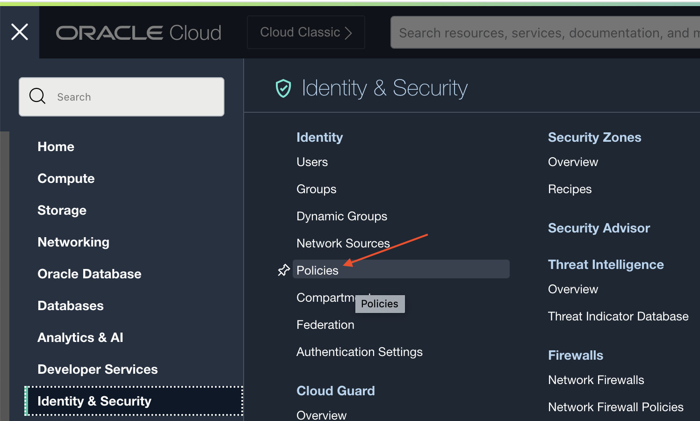
3. Select the compartment of interest and click on *Create Policy* button.
   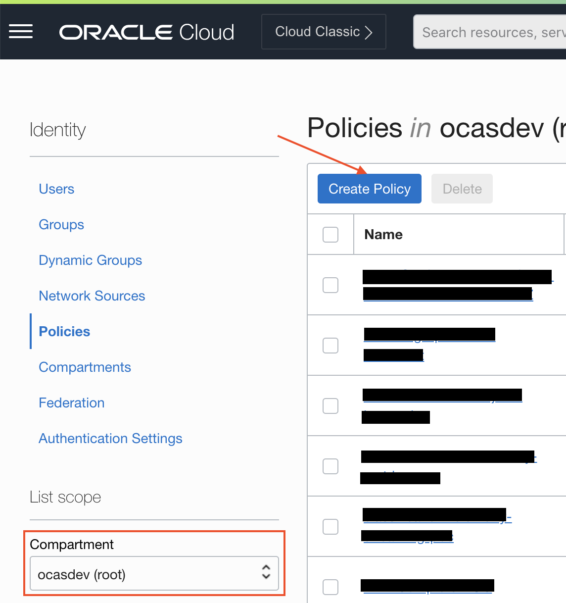
4. Add name, description, and policy statements, and click on *Create* button.
   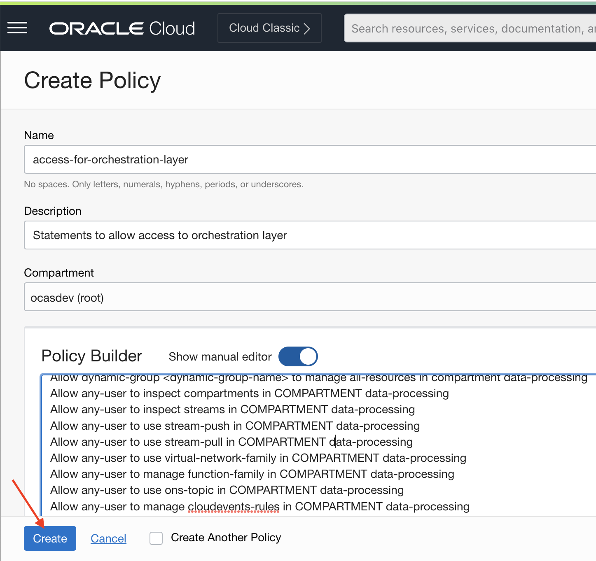

See [README.md](./README.md) for additional details.

### Create and deploy function

Go to `Developer Services >> Functions >> Applications`. Follow
the [official doc](https://docs.oracle.com/en-us/iaas/Content/Functions/Tasks/functionsquickstartcloudshell.htm) and
create all the resources you need via cloud shell. You can also directly follow the **Getting started** session
inside `Applications`. Different from the guide, here we are using Python, so when we generate a 'hello-world'
boilerplate function, we use the following command:

```
fn init --runtime python <function-name>
cd <function-name>
```

And we will substitute the default hello-world code template `func.py` with our
own [sample](./example_code/end_to_end_example/func.py).

Then deploy it:

```
fn -v deploy --app <application-name>
```

After deployment, you can enable the log in function for debuging purpose.

Stack traces and logs will be pumped to the log, and it's very useful when the function goes wrong and debug.

### Create and configure event

Again, event is listening to object storage and triggering the event we created. By understanding this, it will make the
process smoother.

Go to `Observability & Management >> Events Service >> Rules` and create a rule like this:


Brief explain:

- The event type is `Object Storage`, listening to the objects' **create** and **update**. So whenever an object
  uploaded, the event should be triggered.
- An attribute should be added by assigning the target `bucketName`. We only want the event to be triggered when a file
  is uploaded to a right bucket.
- We need to assign an action the Events Service should take once it receives the object upload event from bucket. That
  will be the function we just generated above.

Refer to the [official doc](https://docs.oracle.com/en-us/iaas/Content/Events/Concepts/eventsoverview.htm) for more
information.

**nit**: One thing deserves mentioning is the content of event is not configurable by developers. A sample event for **
object event** looks like the following:

```
{
  "eventType" : "com.oraclecloud.objectstorage.updatebucket",
  "cloudEventsVersion" : "0.1",
  "eventTypeVersion" : "2.0",
  "source" : "ObjectStorage",
  "eventTime" : "2022-06-16T22:29:47Z",
  "contentType" : "application/json",
  "data" : {
    "compartmentId" : "ocid1.compartment.oc1..xxxxxxx",
    "compartmentName" : "xxxxxx",
    "resourceName" : "xxxxxxxx",
    "resourceId" : "/n/xxxxxx/b/xxxxxx/",
    "availabilityDomain" : "PHX-AD-1",
    "freeformTags" : { },
    "definedTags" : {
      "Oracle-Tags" : {
        "CreatedBy" : "xxxxxx",
        "CreatedOn" : "2022-06-16T21:44:45.680Z"
      }
    },
    "additionalDetails" : {
      "bucketName" : "xxxxxx",
      "publicAccessType" : "NoPublicAccess",
      "versioning" : "Disabled",
      "namespace" : "xxxxxxx",
      "eTag" : "xxxx-xxxxx-xxxxx-xxxxx"
    }
  },
  "eventID" : "xxxx-xxxxx-xxxxx-xxxxx",
  "extensions" : {
    "compartmentId" : "ocid1.compartment.oc1..xxxxxxx"
  }
}
```

Different event types have different event structure. You can figure out the details by setting up
an [notification](https://docs.oracle.com/en-us/iaas/Content/Notification/Concepts/notificationoverview.htm) triggered
by an event that sending email, which will include the complete event content in json. See more details
in [official doc](https://docs.oracle.com/en-us/iaas/Content/Events/Reference/eventenvelopereference.htm).

### Set up Data Flow

Follow the [Remove unnecessary column](./remove_unnecessary_columns.md). No change is necessary.

## Test

Once all the configurations are done, upload the following json to the bucket you created:

```
{
    "inputCSV": "oci://<bucket-name>@<namespace>/<csv-file>",
    "columnsToRemove": "<target-column(s)>",
    "outputPath": "oci://<bucket-name>@<namespace>/<path-to-file>"
}
```

If everything goes well, you should see a new run is triggered under `Data Flow >> Applications >> <Your-application>`.


    
